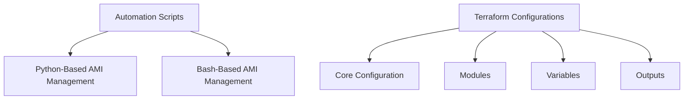
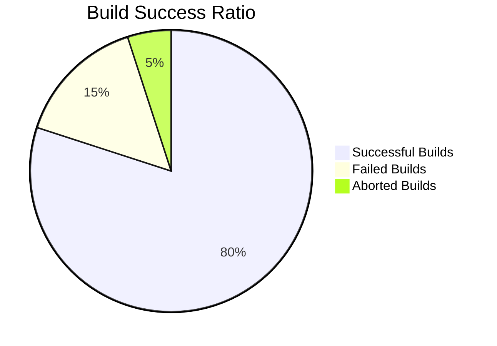

# Automation and IaC Repository

Welcome to the **Automation and Infrastructure as Code (IaC)** repository! This repository showcases advanced automation solutions and Terraform configurations for modern infrastructure management, with a focus on scalability, efficiency, and best practices.

---

## Repository Structure

### Key Directories

#### `1_Automation`

This directory contains robust automation scripts to streamline infrastructure management:

- **`For_Large_Infra/`**:
  - **`Ami_details_Python.py`**: A Python script to manage and fetch Amazon Machine Image (AMI) details with precision.
  - **`README.md`**: Documentation specific to large-scale automation.

- **`Simpler_Bash_solution/`**:
  - **`AMI_Details_bash.sh`**: A lightweight Bash script for quick and simple AMI management.
  - **`README.md`**: Documentation tailored to smaller-scale automation.

#### `2_IaC`

This directory contains Terraform configurations for provisioning and managing cloud infrastructure:

- **`main.tf`**: The core Terraform configuration file for defining resources.
- **`modules/`**: Modular Terraform components for reusable infrastructure definitions.
- **`outputs.tf`**: Defines and displays outputs from Terraform executions.
- **`variables.tf`**: Parameterizes Terraform configurations for flexibility.
- **`README.md`**: Documentation for understanding the Terraform setup.

---

## Features and Highlights

### Automation Scripts

#### Python-Based AMI Management

- **File**: `For_Large_Infra/Ami_details_Python.py`
- **Capabilities**:
  - Fetches detailed AMI information using AWS APIs.
  - Supports filtering by tags, creation dates, and other criteria.
  - Designed for managing large-scale cloud environments.
- **Ideal For**: Teams looking to integrate Python-based automation into CI/CD pipelines.

#### Bash-Based AMI Management

- **File**: `Simpler_Bash_solution/AMI_Details_bash.sh`
- **Capabilities**:
  - Quick, scriptable AMI detail retrieval.
  - Minimal dependencies, suitable for lightweight automation.
- **Ideal For**: Developers requiring a simple, fast solution for small-scale environments.

### Terraform Infrastructure

#### Core Configuration

- **File**: `main.tf`
- **Purpose**: Defines essential infrastructure components, including compute, storage, and networking.
- **Key Features**:
  - Supports multi-cloud setups.
  - Modular design enables scalability and reuse.

#### Modular Components

- **Directory**: `modules/`
- **Purpose**: Encapsulates reusable Terraform code for common infrastructure components.
- **Key Features**:
  - Encourages DRY (Don't Repeat Yourself) principles.
  - Simplifies maintenance and scalability.

#### Parameterized Configurations

- **File**: `variables.tf`
- **Purpose**: Centralized variable definitions for customizable deployments.
- **Key Features**:
  - Enables dynamic provisioning based on environment-specific inputs.
  - Improves code readability and reusability.

#### Outputs

- **File**: `outputs.tf`
- **Purpose**: Displays critical infrastructure details after execution.
- **Key Features**:
  - Facilitates integrations with monitoring and deployment tools.

---

## Interactive Workflow

### Pipeline Overview



### Pipeline Success Visualization



### Security Analysis

```mermaid
bar
    title Vulnerability Breakdown
    "Critical" : 10
    "High" : 20
    "Medium" : 30
    "Low" : 40
```

---

## Best Practices

1. **Use Modular Infrastructure**: Leverage reusable Terraform modules for consistent and efficient infrastructure management.

2. **Parameterize Configurations**: Define variables for environment-specific customizations.

3. **Automate with Purpose**: Select the appropriate automation tool (Python or Bash) based on your infrastructure scale and complexity.

4. **Monitor Outputs**: Use Terraform outputs to integrate with observability tools.

---

## Conclusion

This repository demonstrates advanced automation and IaC practices for scalable infrastructure management. Whether managing a small project or a large enterprise environment, these tools and scripts ensure efficiency, reliability, and security.

> Learn more about [Terraform](https://www.terraform.io/) and explore [AWS Documentation](https://aws.amazon.com/documentation/) to enhance your expertise.

